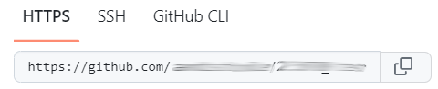

# Einrichten des Arbeitsplatzes

Für den Unterricht verwenden wir die Programmiersprache Python. Dazu
sind ein paar Vorbereitungsarbeiten erforderlich. Sie installieren dabei
nicht nur die erforderliche Software, sondern Sie lernen gleichzeitig
Ihr System vom Terminal aus zu warten.

## Installation der erforderlichen Software

1. Öffnen Sie Windows PowerShell als Administrator (Windows Taste
   drücken, PowerShell eingeben, "als Administrator ausführen" klicken,
   die Frage "Möchten Sie zulassen, dass durch diese App Änderungen an
   Ihrem Gerät vorgenommen werden?" mit Ja beantworten)
2. Im sich öffnenden Fenster den Befehl `Get-ExecutionPolicy` mit der
   Tastatur eingeben und mit Enter bestätigen.
   Wenn die Ausgabe `Restricted` lautet, den Befehl `Set-ExecutionPolicy
   AllSigned` mit der Tastatur eingeben und durch Enter bestätigen.
3. Den Befehl

   ```
   Set-ExecutionPolicy Bypass -Scope Process -Force; [System.Net.ServicePointManager]::SecurityProtocol = [System.Net.ServicePointManager]::SecurityProtocol -bor 3072; iex ((New-Object System.Net.WebClient). DownloadString('https://community.chocolatey.org/install.ps1'))
   ```

  
   kopieren und einfügen. Einfügen in der PowerShell erfolgt durch
   Rechtsklick im Fenster. Den eingefügten Befehl durch Enter
   bestätigen.
   
   Die Ausführung dieses Befehls dauert einen Moment.
4. Wenn keine Fehlermeldungen ausgegeben werden, kann Python mit dem
   Befehl
   ```
   choco install python
   ```
   installiert werden.
5. Damit Python gestartet werden kann, muss dem System mitgeteilt
   werden, wo das Programm zu finden ist. Dazu müssen die
   Umgebungsvariabeln angepasst werden. Um das zu tun, drücken Sie die
   Windows-Taste und geben "Umgebungsvariablen" ein. Im sich öffnenden
   Fenster scrollen Sie in der oberen Liste (Benutzervariablen für ...)
   bis zum Eintrag "Path". Wählen Sie diesen Eintrag aus und klicken Sie
   "Bearbeiten". Wählen Sie "Neu" und geben auf dieser Zeile
   `C:\ProgramData\chocolatey\bin` ein. Bestätigen Sie zwei Mal mit
   "OK".
6. Kontrollieren Sie, ob Python installiert worden ist, in dem Sie in
   der PowerShell `python` eingeben. Sie sollten eine Zeile sehen, die
   mit `>>>` beginnt.

   Traditionellerweise ist das erste Programm, das in einer neu
   installierten Umgebung geschrieben wird, ein sogenanntes "Hello
   World!". In Python gibt man dazu
   ```python
   print("Hello World!")
   ```
   ein und
   bestätigt mit Enter. Die Ausgabe ist dann "Hello World".

   Grundsätzlich können Sie jetzt auf Ihrem Computer Python Programme
   schreiben.
   
   Allerdings ist das nicht sehr komfortabel. Daher installieren wir
   noch ein paar zusätzliche Programme.

7. Installieren Sie Visual Studio Code, indem Sie
   ```
   choco install vscode
   ```
   in der PowerShell eingeben.

8.  Installieren Sie die Jupyter-Notebook extension für Visual Studio
    Code, indem Sie
    ```
    choco install vscode-jupyter
    ```
    in der PowerShell
    eingeben.

9.  Für die Zusammenarbeit in der Klasse brauchen Sie noch die
    Versionsverwaltungssoftware "git". Der Befehl dazu lautet
    ```
    choco install git.install
    ```
   
Sie können mit dem Befehl `choco install ...` weitere Software
installieren. Verfügbare Software finden Sie auf der Website von
[chocolatey](https://chocolatey.org/). Bereits installierte Software
können Sie mit dem Befehl `choco upgrade all` auf den aktuellen Stand
bringen.

## Laden des ersten Jupyter Notebooks

1. Erstellen Sie in Ihrer Dateistruktur unterhalb des Ordners "Schule"
   (oder KBW oder wie Ihr Schulordner auch immer benannt ist) einen
   Ordner mit dem Namen "Informatik".

2. Gehen Sie zur Website von GitHub (github.com).
3. Erstellen Sie einen Account mit Ihrer Schul-Email.
4. Suchen Sie nach dem [Repositoriy I_gW_23-27/Skript](https://github.com/I-gW-23-27/Skript).
5. Klicken Sie oben rechts den mittleren Button ("Fork")
   
   

6. Auf der folgenden Seite übernehmen Sie die Standardeinstellungen und
   klicken Sie unten den grünen Button "Create fork"
7. Öffnen Sie den Windows Explorer und navigieren Sie zum Schulordner
   und klicken Sie den Ordner "Informatik" mit der rechten Maustaste an.
   Wählen Sie im Kontextmenü "Im Terminal öffnen".

8. Führen Sie in diesem Terminal die beiden Befehle
   ```git
   git config --global user.name "John Doe"
   ```
   sowie
   ```
   git config --global user.email johndoe@example.com
   ```
   aus.

   Ersetzen Sie dabei John Doe mit dem von Ihnen gewählten GitHub User
   Namen und johndoe@example.com durch Ihre KBW Mail-Adresse.

1.  Wechseln Sie auf die Website von GitHub in das Repositoriy "I_gW_23-27/Skript".
2.   Klicken Sie auf den grünen Button "Code".
3.  Wählen Sie im Drop Down Menü "HTTPS".

    

    Kopieren Sie mit dem Symbol den dortigen Link.
4.  Wechseln Sie zurück ins Terminalfenster und geben Sie dort den
    Befehl `git clone` ein und ergänzen Sie
    die Zeile mit dem Inhalt Ihrer Zwischenablage (Rechtsklick ins Terminalfenster). Schliessen
    Sie die Eingabe mit `Enter` ab.
5.  Schliessen Sie das Terminalfenster.
6.  Öffnen Sie im Windows Explorer den Ordner Informatik. Klicken Sie
    den Ordner "I_gW_23-27" mit der rechten Maustaste an.
    Wählen Sie im Kontextmenü "Weitere Optionen anzeigen".
   
    Im folgenden Menü wählen Sie "Mit Code öffnen".

    


15. Im Ordner Informatik öffnen Sie den neuen Ordner "I_gW_23-27" in VS Code.
16. Im Fenster von VS Code können Sie nun die Datei 02_start.ipynb
    öffnen. Anschliessend können Sie den Anweisungen im Notebook folgen.


Hier geht es zurück zur [Übersicht](index.md).
