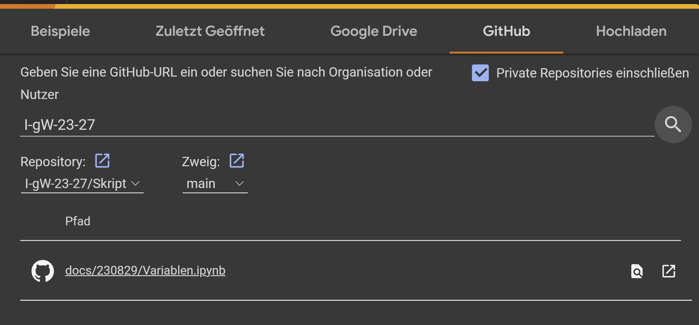

# Variablen in Python

Alle Materialien und Übungen zur heutigen Lektion finden sich im
[Jupyternotebook](https://nbviewer.org/github/I-gW-23-27/Skript/blob/main/docs/230829/Variablen.ipynb)
zum Thema Variablen in Python.

Alternativ kann das Notebook auch online in
[Google Colab](https://colab.research.google.com/notebooks/intro.ipynb)
geöffnet werden - dies erfordert zum Speichern der Datei allerdings
einen Google Account. In
Google Colab wählen Sie das Menü Datei > Notebook öffnen. Im sich
öffnenden Fenster wählen Sie GitHub und füllen die Angaben gemäss
folgendem Sreenshot aus.

Hier geht es zurück zur [Übersicht](../index.md).
