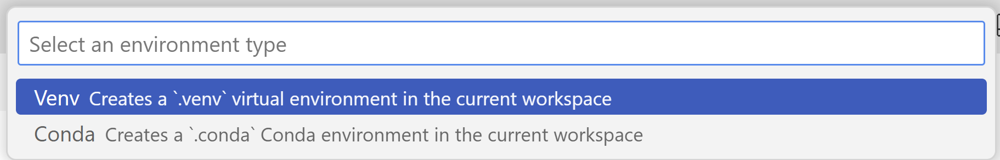
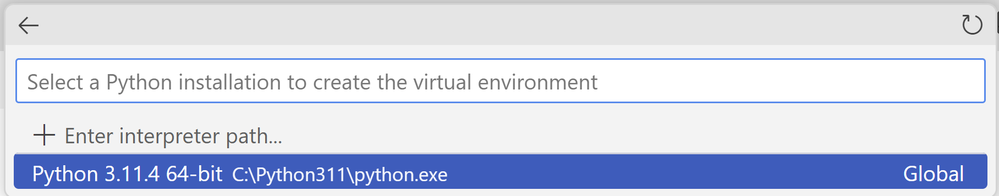

# Einführung in PyTamaro

[PyTamaro](https://pytamaro.si.usi.ch/)
ist eine von der
[Univeristät der Italienischen Schweiz](https://www.usi.ch)
entwickelte Python Library. Die Library wurde entwickelt, damit
Schülerinnen und Schüler Grafiken zeichnen können. Anhand dieser selber
gezeichneten Grafiken werden grundlegende Konzepte des Programmierens
erfahrbar.

## Installation von PyTamaro

### Vorbemerkungen für die Installation von zusätzlichen Python Libraries

Wenn Python auf einem Computer installiert wird, stehen alle
Grundfunktionen zur Verfügung. Darüber hinaus gibt es viele bereits
aufbereitete Zusatzfunktionalitäten. Diese Zusatzfunktionalitäten werden
in sogenannten Libraries zur Verfügung gestellt. Damit deren
Funktionalitäten genutzt werden können, müssen die Libraries auf dem
Computer installiert werden.

Auf einem Computer werden wahrscheinlich verschiedene Python Projekte
parallel bearbeitet. Diese Projekte brauchen verschiedene Libraries,
die möglicherweise zueinander in Konflikt stehen. Diese Konflikte werden
verhindert, indem jedes Projekt in einer eigenen *Virtual Environment*
bearbeitet wird. Eine solche *Virtual Environment* schafft eine
abgeschottete Umgebung.

Eine *Virutal Environment* kann in VS Code realisiert werden,
indem man mit der Tastenkombination Ctrl + Shift + P die *Kommando
Palette* aufruft. In der sich öffnenden Zeile gibt man dann `Python:
Create Environment` ein (wahrscheinlich muss nicht der vollständige Text
eingegeben werden, VS Code unterstützt hier Autovervollständigung).


Als nächstes ist in der Kommando Palette `Venv Creates a '.venv' virtual
environment in the current workspace` auszuwählen.



Dann muss noch die gewünschte Python Installation ausgewählt werden (in
Ihrem Fall dürfte nur eine zur Verfügung stehen).



Damit ist die Einrichtung der *Virtual Environment* abgeschlossen.

## Installation PyTamaro

PyTamaro wird vom Terminal aus installiert. Öffnen Sie ein neues
Terminal (Terminal > New Terminal). Im sich öffnenden Terminal sollten
Sie als letzte Zeile so etwas wie

```powershell
(.venv) PS C:\... ...\Informatik>
```

sehen.

Dort geben Sie den Befehl

```powershell
python -m pip install pytamaro
```

ein.

Damit steht Ihnen ab sofort in diesem Ordner innerhalb von VS Code
PyTamaro zur Verfügung.

## PyTamaro in Action

[Hier finden Sie eine Anwendungsübung]([./pytamaro.ipynb](https://nbviewer.org/github/I-gW-23-27/Skript/blob/main/docs/230905/pytamaro.ipynb))
für PyTamaro.